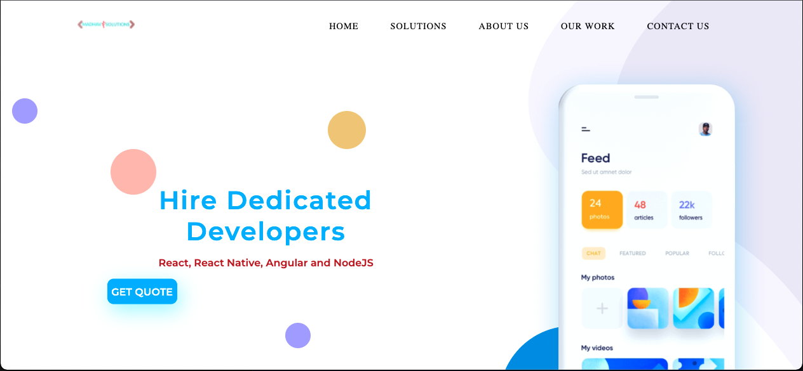
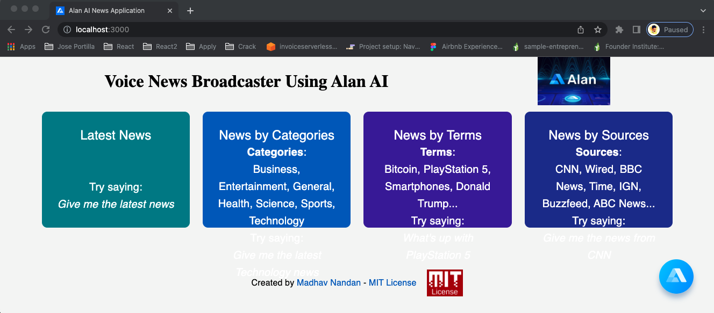
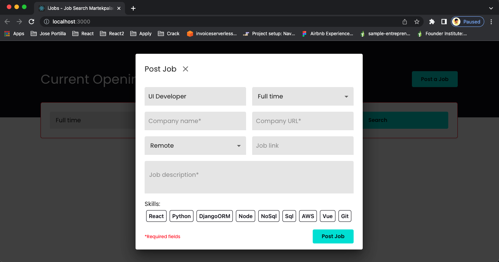
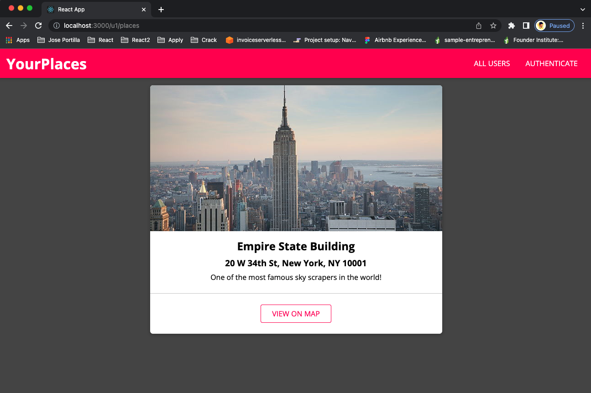
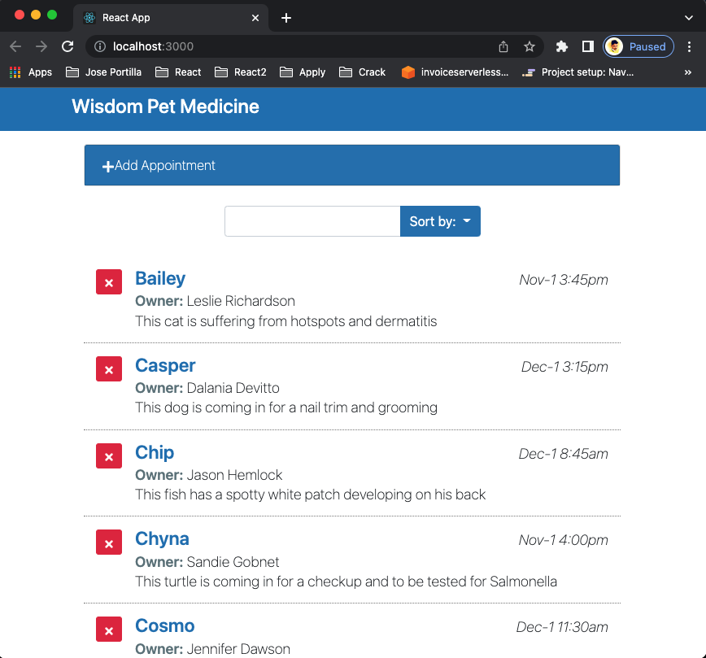

## Hi there! 

&nbsp;

- :technologist: I am a `MERN Stack` Developer at XongoLab LLP, Ahmedabad.
- :technologist: I love using Software as a solution for every `Problem`
- :computer: I'm using `React`, `Node`, `Material-UI`, `Firebase`, `Hooks`, `MongoDB`,`HTML`, `CSS`, and `JavaScript` to make webapplications, websites dance.🕺🏽
- :thinking: I’m currently open for: `job opportunity` with good `pay and perks`, this is [MY RESUME](https://drive.google.com/file/d/1gdiny_4f5TVbSdfyAQxokLMMrBTi054P/view?usp=sharing).
- :nerd_face: Always `learning new things`

 

## 🔥 Streak Stats

 

  
<b>⚡ Recent GitHub Activity</b>

   
   
   

**I love working with**

  
  
  
  
  
  
  

### 🔭 I’m working on

- Projects for freelance clients.
- My `entrepreneurial skills`, `market and customer knowledge`, `sales knowledge`.
- My Proposal pitch for my dream `startup`.

### 🌱 I’m learning

  
  
  
  

### 🤔 I’m looking for help with

- Integrating AI models to web applications

### 📫 How to reach me

  
  
  

 
 
<h1>Some of my Projects! 🎨</h1>
 
 
<h4>Yet to Edit....</h4>

[Landing Page in React](https://github.com/madhav06/30DaysReact-Challange/tree/master/React_01/landing-pages-react/madhav-landing)
 
 

 
 

[AI Supported News App in React](https://github.com/madhav06/voice_assist_app)
 

 

[Job Search App in React](https://github.com/madhav06/Goofy-React-Learning/tree/main/react-indeed)
 

 

[Tourbar App in React](https://github.com/madhav06/tourbar)
 

 

[Appointment App in React](https://github.com/madhav06/Goofy-React-Learning/tree/main/reactinterface)
 

----

Credit:[Madhav Nandan](https://github.com/madhav06)
Last Edited on: 13/5/2022

